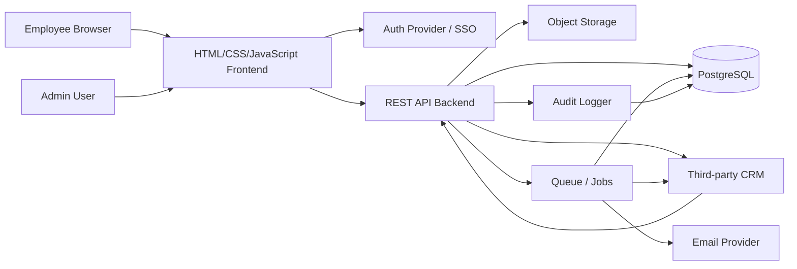
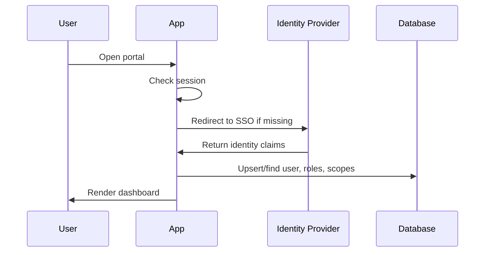

# 03 Technical Architecture

## Recommended Stack

| Layer | Recommendation | Reason |
| --- | --- | --- |
| Frontend | HTML, CSS, and vanilla JavaScript modules | Simple deployment, low framework overhead, easy hosting |
| Language | JavaScript | Native browser support and no compile step required |
| UI | Custom CSS design system and reusable component scripts | Keeps the interface consistent without a frontend framework |
| Forms | Native HTML forms plus JavaScript validation | Accessible by default and easy to enhance |
| Database | PostgreSQL | Relational data, constraints, transactions, search extensions |
| Backend | REST API service, recommended Node.js with Express or PHP | Clear separation between static frontend and secured data operations |
| Data access | SQL migrations and parameterized queries | Predictable schema control and safe database access |
| Auth | Session authentication with OIDC/SAML-ready provider strategy | Supports local dev and enterprise SSO |
| Search | PostgreSQL full-text search for MVP | Avoids premature search infrastructure |
| Files | S3-compatible object storage | Durable file handling independent of app server |
| Jobs | BullMQ + Redis or managed queue | Notifications, sync, scheduled publishing |
| CRM integration | Backend adapter layer plus scheduled sync/webhook ingestion | Keeps the frontend independent from a specific CRM vendor |
| Email | Provider abstraction | Allows SendGrid, SES, Postmark, SMTP |
| Observability | OpenTelemetry, structured logs, Sentry | Debugging and production visibility |
| Testing | Node test runner or PHPUnit, API integration tests, Playwright | Unit, integration, and end-to-end coverage |

## System Diagram

## Application Modules

- Auth and session management.
- Authorization and policy checks.
- Dashboard aggregation.
- Announcements and acknowledgement tracking.
- People directory and profiles.
- Resources and files.
- Request catalog, submissions, workflow engine, approvals.
- Tasks and notifications.
- Admin configuration.
- Audit logging.
- Search.
- CRM sync and write-back orchestration.

## CRM Integration Architecture

The portal should not call the third-party CRM directly from browser JavaScript. The frontend reads and mutates portal API endpoints; the backend owns CRM credentials, mapping, retries, permissions, and audit logs.

Recommended components:

- CRM adapter: vendor-specific client behind a stable internal interface such as `listPeople`, `listRequests`, `createRequest`, `updateApproval`, and `getSyncStatus`.
- Sync worker: scheduled job that pulls changed CRM records into local portal tables for fast dashboard reads.
- Webhook receiver: optional endpoint for CRM change events when the CRM supports signed webhooks.
- Write-back queue: mutations created in the portal are validated, authorized, audited, queued, and posted to the CRM with retry handling.
- Reconciliation job: compares local records against CRM source records and flags sync conflicts.

Source of truth:

- CRM is source of truth for employee/customer/request records that originate there.
- Portal database stores cached projections, portal-only settings, workflow state, acknowledgements, notifications, audit logs, and sync metadata.
- Portal UI displays sync health and last updated timestamps wherever stale data could affect decisions.

## Authorization Model

Authorization uses three layers:

1. Authentication: user identity is known.
2. Role permission: user has a role permission such as `announcement.create`.
3. Scope check: user can only act within allowed department/location/audience scope where applicable.

Example permissions:

- `announcement.read`
- `announcement.create`
- `announcement.publish`
- `resource.manage`
- `request.submit`
- `approval.act`
- `workflow.manage`
- `user.manage`
- `role.manage`
- `audit.read`

## Auth Flow

## Data Access Pattern

- Static or server-rendered HTML pages load initial shell markup.
- Browser JavaScript modules fetch dashboard, table, search, and detail data from REST endpoints.
- Form submissions go through REST endpoints using normal form posts or `fetch`.
- Every mutation validates input on the backend.
- Every mutation checks authorization server-side.
- Every sensitive mutation writes an audit event in the same transaction where possible.
- CRM-backed mutations write to the local audit log before and after CRM write-back so failed outbound sync attempts are traceable.

## Search Strategy

MVP:

- Use PostgreSQL full-text search across announcements, resources, people, request titles, and tags.
- Filter results by authorization before returning.
- Store a searchable text vector per searchable entity or use generated indexes.

Future:

- Add OpenSearch/Meilisearch/Typesense if ranking, synonyms, typo tolerance, or large scale requires it.

## File Handling

- Upload files through signed upload URLs or server-mediated upload.
- Store metadata in `files`.
- Store binary content in object storage.
- Virus scanning can be added as an async job.
- Access to downloads must be authorized and time-limited.

## Notifications

Notification creation happens inside app mutations or queue jobs.

Channels:

- In-app for MVP.
- Email for critical/approval events.
- Teams/Slack/push as future channels.

## Environments

- Local: static frontend server, local API server, local PostgreSQL, local object storage optional.
- Staging: production-like auth sandbox and database.
- Production: managed PostgreSQL, object storage, monitoring, backups.

## Security Requirements

- HTTPS only in production.
- Secure, httpOnly session cookies.
- CSRF protection for cookie-based mutations.
- Rate limits on auth, search, and write-heavy endpoints.
- Rich text sanitization.
- File type validation.
- Server-side authorization on every page and endpoint.
- Audit logs for admin and workflow decisions.
- Regular dependency scanning.

## Deployment

- Docker image built in CI.
- Run lint, tests, migrations check, and Playwright smoke tests before deployment.
- Migrations run as a controlled release step.
- App health endpoint verifies database connectivity and build metadata.

## API Gateway
### Purpose
The API Gateway is the single entry point for all client requests. It centralizes authentication, authorization, routing, rate limiting, and observability while hiding internal services from clients.

#### Responsibilities
* Route requests to backend services.
* Validate authentication tokens or session cookies.
* Apply role and permission checks.
* Enforce HTTPS.
* Apply rate limiting.
* Log every request.
* Compress responses.
* Handle CORS.
* Return standardized error responses.

## Database / External Services
### Future Scalability
The gateway should support routing to independent services such as:

* Authentication Service
* User Service
* Calendar Service
* Notification Service
* Reporting Service
* Optional approved department/application services
without requiring frontend changes.

### Caching Strategy
#### Goals

* Reduce database load.
* Improve dashboard performance.
* Speed up repeated queries.

#### Cache Technology
Redis
#### Cached Data
Dashboard

* Announcements
* Birthdays
* Staff on leave
* Calendar summaries

Application Data

* Department list
* Roles
* Navigation
* Frequently accessed resources

Search

* Popular search terms
* Recently viewed pages

Session

* User sessions
* Permission lookups

#### Cache Rules
Dashboard

TTL
5 minutes
Company Events

TTL
15 minutes
Department Links

TTL
30 minutes
User Profile

TTL
15 minutes
Permission Cache

TTL
10 minutes
Cache is automatically invalidated whenever administrators update data.

### Logging
#### Objectives

Provide complete traceability for debugging, auditing, and security investigations.

#### Log Categories
Application Logs

* Errors
* Warnings
* Startup
* Shutdown

Access Logs

* Every HTTP request
* Response time
* Status code
* Client IP

Audit Logs

* Login
* Logout
* Permission changes
* User creation
* Content publication
* Request and approval updates
* Admin actions

Security Logs

* Failed logins
* Suspicious activity
* Rate limiting
* CSRF failures

Integration Logs

* Google Workspace
* Email
* LDAP
* External APIs
* Optional approved CRM or department systems

#### Log Format

JSON

Required Fields

* Timestamp
* Request ID
* User ID
* Department
* Service
* Endpoint
* Method
* Response Code
* Duration
* Severity

#### Log Retention

Application Logs
30 days

Audit Logs
365 days

Security Logs
365 days

## Monitoring
### Monitoring Platform
OpenTelemetry
Prometheus
Grafana
Sentry

### Infrastructure Metrics
* CPU
* Memory
* Disk
* Network
* Container Health

### Application Metrics
* Response Time
* Requests Per Second
* Error Rate
* Active Users
* Queue Length
* Failed Jobs

### Database Metrics
* Slow Queries
* Connections
* Locks
* Replication Status

### Alerts
Trigger alerts when:

* CPU exceeds 85%
* Memory exceeds 90%
* Database unavailable
* API latency exceeds 2 seconds
* Error rate exceeds 5%
* Storage reaches 80%
* Backup fails
* SSL certificate expires within 30 days
Alerts should be sent to IT through email and Microsoft Teams.

## CI/CD Pipeline
### Source Control
GitHub

### Branch Strategy
main
production
develop
feature/*
hotfix/*

## Pipeline

Developer

↓

Pull Request

↓

Lint

↓

Unit Tests

↓

Integration Tests

↓

Security Scan

↓

Build Docker Image

↓

Push Image Registry

↓

Deploy Staging

↓

Smoke Tests

↓

Manual Approval

↓

Deploy Production

### Deployment Rules
Every deployment must

* Run database migrations.
* Verify health checks.
* Support rollback.
* Notify administrators.
* Tag release version.

## Containerization
### Platform

Docker
Production
Podman or Docker

### Services
* Frontend
* Backend API
* PostgreSQL
* Redis
* Object Storage
* Reverse Proxy
* Monitoring
* Logging

## Secrets Management
Secrets must never be stored in Git.
Secrets include

* Database passwords
* SMTP credentials
* OAuth secrets
* API Keys
* JWT secrets
* Encryption keys
* Object storage credentials

Recommended Storage

Development

.env

Production

Docker Secrets

HashiCorp Vault
or Kubernetes Secrets

Secret rotation should occur every 90 days.

## Environment Variables
### Required Variables
#### Application
APP_NAME

APP_ENV

APP_URL

#### PORT

#### Database
DB_HOST

DB_PORT

DB_NAME

DB_USER

DB_PASSWORD

#### Authentication
OIDC_CLIENT_ID

OIDC_CLIENT_SECRET

OIDC_DISCOVERY_URL

#### Email
SMTP_HOST

SMTP_PORT

SMTP_USERNAME

SMTP_PASSWORD

#### Storage
S3_ENDPOINT

S3_BUCKET

S3_ACCESS_KEY

S3_SECRET_KEY

#### Monitoring
SENTRY_DSN

OTEL_ENDPOINT

## Backup Strategy
### Database

Full backup
Daily
Incremental backup
Every hour
Retention
90 days

### Object Storage
Nightly snapshot
Versioning enabled

### Configuration
Backup
* Environment files
* Reverse proxy configuration
* Scheduled jobs
Backups must be encrypted before leaving the server.

## Disaster Recovery
### Recovery Objectives

Recovery Time Objective (RTO)
Less than 2 hours
Recovery Point Objective (RPO)
Less than 1 hour

### Recovery Process
1. Restore infrastructure.
2. Restore PostgreSQL.
3. Restore object storage.
4. Restore configuration.
5. Restore application containers.
6. Validate integrations.
7. Run health checks.
8. Re-enable user access.
Disaster recovery procedures should be tested at least twice per year.

## Scaling Strategy
### Horizontal Scaling
Frontend
Multiple instances behind a load balancer.
Backend
Multiple API containers.
Redis
Shared cache cluster.
PostgreSQL
Primary with read replicas.

### Vertical Scaling
Increase

* CPU
* Memory
* Storage
before horizontal scaling when appropriate.

### Load Balancer
Responsibilities

* SSL termination
* Health checks
* Session affinity (if required)
* Traffic distribution

### High Availability
* Multiple application instances
* Redundant reverse proxy
* PostgreSQL replication
* Automatic container restart
* Monitoring-based auto-recovery

### Future Scaling
The architecture should support independently scaling high-demand modules, including:

* Notifications
* Search
* Reporting
* Calendar
* Optional approved workflow modules
This allows heavily used features to grow without affecting the performance of the rest of the intranet.
