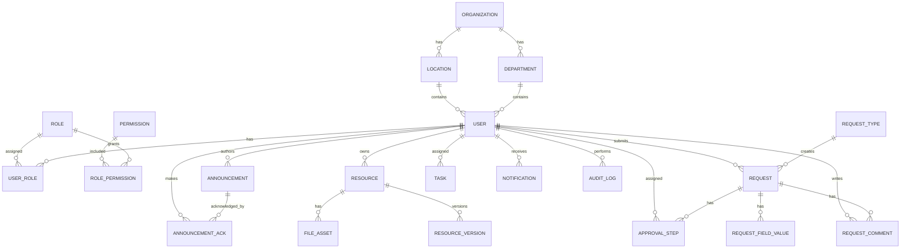

# 04 Data Model

## Entity Relationship Overview

## Core Tables

### organizations

| Field | Type | Constraints |
| --- | --- | --- |
| id | uuid | primary key |
| name | text | required |
| slug | text | required, unique |
| status | enum | active, inactive |
| created_at | timestamptz | required |
| updated_at | timestamptz | required |

### users

| Field | Type | Constraints |
| --- | --- | --- |
| id | uuid | primary key |
| organization_id | uuid | fk organizations.id, required |
| department_id | uuid | fk departments.id, nullable |
| location_id | uuid | fk locations.id, nullable |
| manager_id | uuid | fk users.id, nullable |
| email | citext | required, unique per organization |
| employee_number | text | nullable, unique per organization |
| first_name | text | required |
| last_name | text | required |
| preferred_name | text | nullable |
| job_title | text | nullable |
| avatar_file_id | uuid | fk file_assets.id, nullable |
| phone | text | nullable |
| status | enum | active, invited, suspended, deactivated |
| last_login_at | timestamptz | nullable |
| created_at | timestamptz | required |
| updated_at | timestamptz | required |

### departments

| Field | Type | Constraints |
| --- | --- | --- |
| id | uuid | primary key |
| organization_id | uuid | fk organizations.id, required |
| parent_department_id | uuid | fk departments.id, nullable |
| name | text | required |
| slug | text | required, unique per organization |
| status | enum | active, inactive |

### locations

| Field | Type | Constraints |
| --- | --- | --- |
| id | uuid | primary key |
| organization_id | uuid | fk organizations.id, required |
| name | text | required |
| country | text | nullable |
| city | text | nullable |
| timezone | text | required |
| status | enum | active, inactive |

## Authorization Tables

### roles

| Field | Type | Constraints |
| --- | --- | --- |
| id | uuid | primary key |
| organization_id | uuid | fk organizations.id, nullable for system roles |
| name | text | required |
| slug | text | required |
| description | text | nullable |
| is_system | boolean | default false |

### permissions

| Field | Type | Constraints |
| --- | --- | --- |
| id | uuid | primary key |
| key | text | required, unique |
| description | text | nullable |

### user_roles

| Field | Type | Constraints |
| --- | --- | --- |
| user_id | uuid | fk users.id |
| role_id | uuid | fk roles.id |
| scope_type | enum | global, department, location |
| scope_id | uuid | nullable |
| created_at | timestamptz | required |

Unique: `user_id`, `role_id`, `scope_type`, `scope_id`.

## Content Tables

### announcements

| Field | Type | Constraints |
| --- | --- | --- |
| id | uuid | primary key |
| organization_id | uuid | required |
| author_id | uuid | fk users.id |
| title | text | required |
| summary | text | nullable |
| body | text | required, sanitized rich text |
| priority | enum | normal, important, critical |
| status | enum | draft, scheduled, published, archived |
| audience | jsonb | required |
| requires_acknowledgement | boolean | default false |
| published_at | timestamptz | nullable |
| expires_at | timestamptz | nullable |
| created_at | timestamptz | required |
| updated_at | timestamptz | required |

### resources

| Field | Type | Constraints |
| --- | --- | --- |
| id | uuid | primary key |
| organization_id | uuid | required |
| owner_id | uuid | fk users.id |
| category_id | uuid | fk resource_categories.id |
| title | text | required |
| description | text | nullable |
| status | enum | draft, published, archived |
| audience | jsonb | required |
| tags | text[] | default empty |
| review_at | timestamptz | nullable |
| created_at | timestamptz | required |
| updated_at | timestamptz | required |

### file_assets

| Field | Type | Constraints |
| --- | --- | --- |
| id | uuid | primary key |
| organization_id | uuid | required |
| uploaded_by_id | uuid | fk users.id |
| storage_key | text | required, unique |
| file_name | text | required |
| mime_type | text | required |
| size_bytes | bigint | required |
| checksum | text | nullable |
| status | enum | pending, available, quarantined, deleted |
| created_at | timestamptz | required |

## Workflow Tables

### request_types

| Field | Type | Constraints |
| --- | --- | --- |
| id | uuid | primary key |
| organization_id | uuid | required |
| name | text | required |
| slug | text | required, unique per organization |
| description | text | nullable |
| category | text | nullable |
| form_schema | jsonb | required |
| workflow_schema | jsonb | required |
| sla_hours | integer | nullable |
| status | enum | active, inactive, archived |

### requests

| Field | Type | Constraints |
| --- | --- | --- |
| id | uuid | primary key |
| organization_id | uuid | required |
| request_type_id | uuid | fk request_types.id |
| submitted_by_id | uuid | fk users.id |
| title | text | required |
| status | enum | draft, submitted, in_review, changes_requested, approved, rejected, cancelled, completed |
| priority | enum | low, normal, high, urgent |
| submitted_at | timestamptz | nullable |
| due_at | timestamptz | nullable |
| completed_at | timestamptz | nullable |
| created_at | timestamptz | required |
| updated_at | timestamptz | required |

### approval_steps

| Field | Type | Constraints |
| --- | --- | --- |
| id | uuid | primary key |
| request_id | uuid | fk requests.id |
| step_order | integer | required |
| approver_id | uuid | fk users.id, nullable |
| approver_role_id | uuid | fk roles.id, nullable |
| status | enum | pending, approved, rejected, skipped, delegated |
| decision_note | text | nullable |
| decided_at | timestamptz | nullable |

## Activity Tables

### tasks

| Field | Type | Constraints |
| --- | --- | --- |
| id | uuid | primary key |
| organization_id | uuid | required |
| assignee_id | uuid | fk users.id |
| source_type | text | required |
| source_id | uuid | required |
| title | text | required |
| status | enum | open, completed, cancelled |
| priority | enum | low, normal, high, urgent |
| due_at | timestamptz | nullable |

### notifications

| Field | Type | Constraints |
| --- | --- | --- |
| id | uuid | primary key |
| organization_id | uuid | required |
| user_id | uuid | fk users.id |
| type | text | required |
| title | text | required |
| body | text | nullable |
| action_url | text | nullable |
| read_at | timestamptz | nullable |
| created_at | timestamptz | required |

### audit_logs

| Field | Type | Constraints |
| --- | --- | --- |
| id | uuid | primary key |
| organization_id | uuid | required |
| actor_id | uuid | fk users.id, nullable for system |
| action | text | required |
| entity_type | text | required |
| entity_id | uuid | nullable |
| metadata | jsonb | required |
| ip_address | inet | nullable |
| user_agent | text | nullable |
| created_at | timestamptz | required |

## Indexing Requirements

- `users`: organization, email, department, location, manager, status.
- `announcements`: organization, status, published_at, expires_at, priority.
- `resources`: organization, status, category, tags.
- `requests`: organization, request_type, submitted_by, status, due_at.
- `approval_steps`: request, approver, status.
- `tasks`: assignee, status, due_at.
- `notifications`: user, read_at, created_at.
- `audit_logs`: organization, actor, action, entity, created_at.
- Full-text search indexes for people, announcements, resources, and request titles.

## Data Integrity Rules

- Users cannot be deleted if they authored content or participated in workflows; deactivate instead.
- Published announcements require `published_at`.
- Expired announcements must not appear in default employee feeds.
- Request status transitions must follow the workflow engine.
- Approval decisions are immutable after final request completion unless reopened by an authorized admin.
- Audit logs are append-only.
- File assets cannot be permanently removed while referenced by published content unless retention policy permits it.

## Migration Strategy
### 1.1 Tooling and conventions
* Migrations are managed with a forward-only, versioned migration tool (e.g. node-pg-migrate, Flyway, or Alembic, depending on stack). Each migration file is timestamp-prefixed and immutable once merged to the main branch.

* One migration = one logical change. Schema changes (DDL) and large backfills (DML) are kept in separate migration files so backfills can be retried independently of structural changes.

* Every migration must have a corresponding down script where technically feasible. Irreversible migrations (e.g. dropping a column) must be preceded by a deprecation migration that stops writes/reads first.
### 1.2 Expand/contract pattern for breaking changes
To avoid downtime, schema changes that are not purely additive follow an expand/contract lifecycle:
1. Expand — add the new column/table/index alongside the old one. Application code is not yet aware of it.
2. Dual-write — deploy application code that writes to both old and new structures.
3. Backfill — run a batched backfill job (rate-limited, resumable, idempotent) to populate the new structure from historical data.
4. Cutover — deploy application code that reads from the new structure; old structure becomes write-only or stops being written to.
5. Contract — after a soak period (minimum one release cycle, longer for critical tables like users or requests), drop the old column/table in a dedicated migration.
1.3 Safety rules
* No migration acquires a long-lived table lock on high-traffic tables (users, requests, notifications, audit_logs). Use CREATE INDEX CONCURRENTLY, add columns as NULL first then backfill, and avoid ALTER COLUMN TYPE on large tables without a shadow-column approach.
* All migrations run through a staging environment seeded with a production-like data volume before being applied to production.
* Migrations are applied automatically in CI/CD on merge, gated by a manual approval step for any migration tagged breaking or touching audit_logs, roles, role_permissions, or user_roles.
* A migration's runtime is estimated against current production row counts; anything projected to exceed a defined threshold (e.g. 5 minutes) must be batched.
1.4 Backfill jobs
* Backfills run as idempotent batch jobs keyed by primary key range or updated_at cursor, with checkpointing so they can resume after failure.
* Backfills write their own progress to a migration_jobs tracking table (id, name, cursor, status, started_at, completed_at, error) so they're observable and restartable without re-scanning completed ranges.

## 2. Soft Delete Strategy
### 2.1 Why soft delete
Per the data integrity rules in 04-data-model.md, users, published content, and anything referenced by workflows or audit trails cannot be hard-deleted. The system uses soft delete as the default deletion mechanism for any entity that is referenced by other tables or that compliance/audit may need to recover.
### 2.2 Mechanism
* Soft-deletable tables (users, departments, locations, roles, announcements, resources, file_assets, requests, request_types) gain two columns not shown in the base schema:
    * deleted_at timestamptz, nullable
    * deleted_by_id uuid, fk users.id, nullable
* A row with deleted_at IS NULL is considered live. A non-null deleted_at marks the row as soft-deleted.
* Every table that supports soft delete has a default-scoped view or ORM-level scope that filters WHERE deleted_at IS NULL, so application queries never need to remember the filter manually.
* Unique constraints that would otherwise collide with soft-deleted rows (e.g. email unique per organization, slug unique per organization) are implemented as partial unique indexes scoped to WHERE deleted_at IS NULL, so a deleted user's email can be reused by a new invite without a manual rename step.

### 2.3 Entity-specific rules
Entity	Soft delete behavior
users	Already modeled via status = deactivated; deleted_at is reserved for GDPR/right-to-be-forgotten erasure requests, distinct from normal deactivation. Deactivation is the everyday path; soft delete is the compliance path.
announcements	Soft delete only permitted after status = archived. Published announcements must be archived first, then deleted.
resources / file_assets	Soft delete cascades a "candidate for deletion" flag to dependent resource_versions, but the underlying storage object is not purged until the retention job confirms no live references exist (see Section 6).
requests	Never soft-deleted while in any non-terminal status (draft, submitted, in_review, changes_requested). Only completed, cancelled, or rejected requests are eligible.
roles / permissions	System roles (is_system = true) cannot be soft-deleted. Custom org roles can be, but only if no user_roles rows reference them with deleted_at IS NULL.
departments / locations	Soft delete blocked while active users.department_id / users.location_id references exist; admins must reassign users first or the operation cascades a reassignment to a configured fallback department/location.

### 2.4 Cascading soft delete
* Soft deletes do not cascade automatically across foreign keys by default — this prevents accidental mass-deletion. Each parent-child relationship that should cascade is implemented explicitly via a trigger (Section 3) or application-layer transaction.
* Exception: resource_versions and request_field_value-style child rows that have no independent lifecycle (pure detail rows) do cascade soft delete with their parent in the same transaction.

### 2.5 Restore
* Any soft-deleted row can be restored by an authorized admin within a defined restore window (default 30 days), which sets deleted_at = NULL, deleted_by_id = NULL and writes an audit_logs entry with action = 'restore'.
* After the restore window closes, the row becomes eligible for the hard-delete retention job (Section 6).

## 3. Triggers
Triggers are kept minimal and used only where application-layer enforcement is insufficient or risks being bypassed (direct SQL access, multiple services writing to the same table). All triggers are documented here so behavior isn't hidden purely in migration files.
### 3.1 set updated at
* Applies to every table with an updated_at column.
* BEFORE UPDATE trigger that sets NEW.updated_at = now() unconditionally, so application code never has to remember to set it and can't accidentally leave it stale.
### 3.2 prevent audit log mutation

* Applies to audit_logs.
* BEFORE UPDATE OR DELETE trigger that raises an exception, enforcing the append-only rule from the data integrity section. Even a privileged database role attempting a manual UPDATE/DELETE is blocked; the only sanctioned removal path is the retention job, which uses a separate, explicitly elevated role that bypasses the trigger via a session-level flag (SET LOCAL audit_log.retention_job = true), checked inside the trigger function.
### 3.3 enforce announcement publish invariant

* Applies to announcements.
* BEFORE UPDATE trigger: if NEW.status = 'published' and NEW.published_at IS NULL, raises an exception (mirrors "published announcements require published_at" rule). Also auto-sets published_at = now() if it's null and the status transition is * → published, as a convenience default.

### 3.4 prevent completed approval mutation
* Applies to approval_steps.
* BEFORE UPDATE trigger: blocks changes to status or decision_note once the parent request.status = 'completed', unless the session has an admin_reopen flag set (paired with an audit_logs entry recording the reopen). Enforces "approval decisions are immutable after final request completion."

### 3.5 cascade resource version soft delete
* Applies to resources.
* AFTER UPDATE trigger: when a resource transitions from deleted_at IS NULL to deleted_at IS NOT NULL, cascades the same deleted_at/deleted_by_id to all child resource_versions.

### 3.6 notify on task assignment
* Applies to tasks.
* AFTER INSERT trigger: enqueues a row into a lightweight outbox table (transactional outbox pattern) so a downstream worker can create the corresponding notifications row and push a real-time event, without coupling the insert transaction to notification delivery latency.

### 3.7 General trigger policy
* Triggers never perform cross-table business logic beyond invariant enforcement, cascading soft-deletes, and outbox writes. Anything more complex (workflow transitions, SLA calculations) lives in the application/workflow engine, not in the database, to keep logic testable and visible in code review.

## 4. Views
Views are used to encapsulate common filtered/joined queries, keep "what counts as live data" consistent across services, and simplify reporting.

### 4.1 active_users
CREATE VIEW active_users AS
SELECT * FROM users
WHERE deleted_at IS NULL
  AND status = 'active';
Used by directory search, mention autocompletion, and notification targeting — anywhere "currently active employees" is the intended population rather than all historical users.

### 4.2 published_announcements_feed
CREATE VIEW published_announcements_feed AS
SELECT * FROM announcements
WHERE deleted_at IS NULL
  AND status = 'published'
  AND published_at <= now()
  AND (expires_at IS NULL OR expires_at > now());
This is the single source of truth for "what should appear in an employee's announcement feed," directly encoding the rule that expired announcements must not appear by default. Application code queries this view rather than re-implementing the expiry condition in multiple places.

### 4.3 overdue tasks
CREATE VIEW overdue_tasks AS
SELECT * FROM tasks
WHERE status = 'open'
  AND due_at IS NOT NULL
  AND due_at < now();
Feeds the overdue-tasks digest notification job.

### 4.4 View maintenance policy
* Views are plain (non-materialized) by default. A view is only promoted to a materialized view if it backs a dashboard/report with a measured query cost that affects user-facing latency (e.g. organization-wide analytics). Materialized views must specify a documented refresh cadence and be refreshed via CONCURRENTLY to avoid blocking reads.
* Views must not be the only place an invariant is enforced — they encode read-time convenience, not write-time correctness, which remains the job of constraints and triggers.

## 5. Detailed Audit Table Policy
### 5.1 What gets logged
audit_logs captures state-changing actions across the system. At minimum, the following actions are logged for every entity that supports them:
* create, update, delete (soft delete), restore
* Authorization changes: role_assigned, role_revoked, permission_changed
* Workflow actions: request_submitted, approval_decided, request_reopened
* Authentication-adjacent events: login_succeeded, login_failed, password_reset_requested, mfa_enrolled
* Administrative actions: user_impersonated, org_setting_changed, data_export_requested

### 5.2 Record shape and content rules
* metadata (jsonb) stores a structured diff where applicable: { "before": {...}, "after": {...} } for updates, restricted to changed fields only — not a full row dump — to limit sensitive data exposure in logs.
* Fields considered sensitive (raw passwords, MFA secrets, full file contents, unredacted national ID numbers if ever stored) are never written into metadata, even in diff form. A documented denylist of column names is enforced at the application layer before any audit write.
* entity_type uses a fixed enum-like set of known table names rather than free text, to keep the audit log queryable and to catch typos at write time.
* actor_id is nullable only for genuinely system-initiated actions (scheduled jobs, migrations); any user-triggered action must always carry an actor_id, including admin-on-behalf-of-user actions (which also record an acting_as_user_id inside metadata).

### 5.3 Write path
* Audit log writes happen in the same database transaction as the business mutation they describe wherever the originating service has direct DB access, guaranteeing they cannot be silently dropped if the mutation succeeds.
* For actions originating outside a single transaction boundary (e.g. cross-service workflow steps), the transactional outbox pattern is used: an outbox row is written transactionally with the business change, and a worker reliably converts it into an audit_logs row.

### 5.4 Read path and access control
* audit_logs is queryable only through a dedicated read API gated by an audit:read permission, separate from general data-access permissions, since audit data can itself be sensitive (e.g. reveals who viewed/exported what).
* Audit log queries are always scoped by organization_id; cross-organization audit queries are restricted to a platform-level super-admin role used solely for support/compliance investigations, itself logged via a meta-audit mechanism (audit log reads of other orgs are themselves audited).

### 5.5 Immutability enforcement
* Enforced at three layers: (1) no UPDATE/DELETE exposed in any application API or ORM model for this table, (2) the prevent_audit_log_mutation trigger (Section 3.2) at the database level, (3) database role permissions revoke UPDATE/DELETE grants on audit_logs from the application's normal runtime role entirely, leaving only INSERT/SELECT.

## 6. Retention Rules
### 6.1 General principle
Retention periods are configured per data category, not per table, since several tables hold mixed-sensitivity data. Defaults below apply unless an organization's contract or regional regulation (e.g. GDPR, sector-specific rules) specifies a stricter period, in which case the stricter period wins.

### 6.2 Retention table
Data category	Default retention	Trigger for countdown	Action at expiry
Soft-deleted user accounts	30 days restore window, then anonymize	deleted_at set	Hard-anonymize PII fields (email, phone, first_name, last_name replaced with placeholders); rows are kept (not hard-deleted) to preserve referential integrity for audit/workflow history
Soft-deleted departments/locations/roles	30 days	deleted_at set	Hard delete if no remaining references exist; otherwise anonymized label retained
Archived announcements	2 years	status = archived transition	Hard delete row and associated announcement_acks
Soft-deleted/archived resources & file assets	1 year, or immediately if no published references and explicit deletion requested	deleted_at set	File bytes purged from storage; file_assets.status = deleted; row metadata kept for audit trail per Section 6.4
Completed/cancelled/rejected requests	7 years	completed_at / terminal status set	Retained for compliance; not auto-deleted by default — review only on explicit org request
notifications	180 days	created_at	Hard delete (low sensitivity, high volume, no compliance need to retain)
audit_logs	7 years minimum, longer if contractually required	created_at	Cold-archived to immutable object storage after 1 year (queried less frequently), then deleted from primary DB only after archive confirms durability; never deleted before the 7-year floor
Authentication events (login_failed, etc., a subtype of audit_logs)	1 year	created_at	Hard delete from hot storage; not subject to the 7-year audit floor since they're operational/security signal rather than business-record audit data

### 6.3 Retention job mechanics
* A scheduled job (retention_sweeper) runs daily per category, querying for rows past their retention threshold in batches (to avoid long-running deletes on large tables), and performs either anonymization or hard delete per the table above.
* The job is idempotent, logs its own run summary (rows processed, rows affected, errors) to an internal operational log distinct from audit_logs, and itself writes an audit_logs entry with action = 'retention_purge' and actor_id = NULL (system-initiated) summarizing what category and count was purged — without listing individual deleted row IDs if doing so would itself be a privacy concern (e.g. listing deleted users' identifiers).

### 6.4 File asset purge specifics
* Hard-deleting a file_assets row's underlying object follows the data integrity rule that files cannot be removed while referenced by published content. The retention job checks for live (non-deleted) references from resources, resource_versions, and users.avatar_file_id before purging; if references exist, the file is skipped and flagged for manual review rather than purged.
* Storage purge and metadata-row update happen in two steps: object storage delete first (idempotent, safe to retry), then file_assets.status = 'deleted' update, so a crash mid-purge never leaves a row claiming deleted while the object still exists undeleted-but-orphaned in a way the system can't detect.

### 6.5 Legal hold override
* Any entity (user, request, resource) can be flagged with a legal_hold = true marker (stored in a separate legal_holds table referencing entity_type/entity_id rather than adding a column to every table) which the retention job checks before acting; rows under legal hold are skipped regardless of how far past their retention threshold they are, until the hold is explicitly lifted by an authorized compliance admin (itself an audited action).

### 6.6 Data subject erasure requests (right to be forgotten)
* An explicit erasure request short-circuits the normal retention timeline: it triggers immediate soft delete (if not already deleted) followed by anonymization at the end of a shortened, configurable grace period (default 72 hours, instead of the standard 30-day restore window), unless blocked by an active legal hold or an in-progress workflow that legally requires the record (e.g. an open approval the user is a required approver for, which must first be reassigned).
