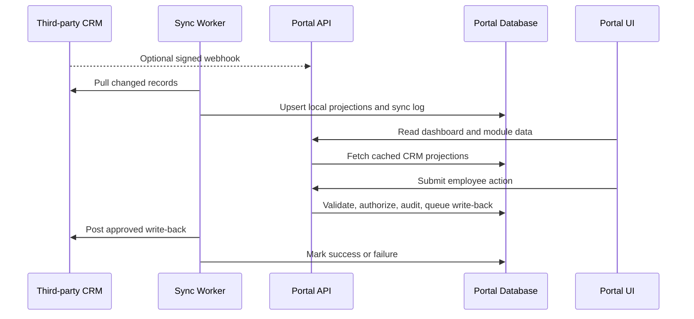

# 12 CRM Integration Plan

## Goal

The intranet portal should reflect the information in the company's third-party CRM and let employees act on CRM-backed work from the dashboard. The portal provides a focused employee experience, while the CRM remains the system of record for CRM-owned entities.

## Integration Principles

- The browser never stores CRM API credentials or calls the CRM directly.
- The backend exposes stable portal endpoints that hide CRM vendor details.
- CRM reads are cached locally for dashboard performance and resilient access.
- Portal writes are validated, authorized, audited, queued, and then written back to the CRM.
- Every CRM-sourced record shown in decision-making screens should expose freshness metadata where useful.

## MVP Scope

- CRM sync status card on the dashboard.
- People directory populated from CRM employee/contact records.
- Requests and approvals queue populated from CRM workflow records.
- Dashboard counts for people, requests, approvals, documents, and tasks.
- Manual sync trigger for admins.
- Failed write-back visibility for admins.

## Data Flow

## Adapter Contract

The backend should define a CRM adapter interface before choosing vendor-specific details:

- `getStatus()`
- `syncSince(timestamp)`
- `listPeople(filters)`
- `listRequests(filters)`
- `createRequest(payload)`
- `updateApproval(stepId, decision)`
- `retryWriteBack(writeBackId)`

## Local Storage Strategy

Local database tables should store CRM projections rather than replace the CRM:

- `crm_connections`: provider, tenant, health, last sync, credential reference.
- `crm_sync_runs`: run status, counts, errors, duration.
- `crm_records`: external id, entity type, local entity id, version/hash, last seen timestamp.
- `crm_writebacks`: payload, status, attempts, last error, audit reference.
- Domain tables such as `users`, `requests`, and `approval_steps` keep normalized fields needed by the portal.

## Conflict Handling

- CRM external ids are unique per provider and entity type.
- Incoming CRM changes update local projections unless a portal write-back is pending.
- Pending write-backs should lock affected fields or show a "sync pending" state.
- Failed write-backs stay visible to admins with retry and cancel actions.

## Security

- Store CRM credentials in a secrets manager or encrypted server-side configuration.
- Verify webhook signatures and reject replayed events.
- Apply portal RBAC before showing CRM data or accepting employee actions.
- Audit CRM reads that expose sensitive data and all CRM write-back attempts.

## Open Questions

- Which CRM vendor and API version will be used?
- Does the CRM support webhooks, delta sync, or only polling?
- Which records are CRM-owned versus portal-owned?
- Which employee actions should write back immediately versus require approval?
- What is the acceptable sync lag for operational decisions?
